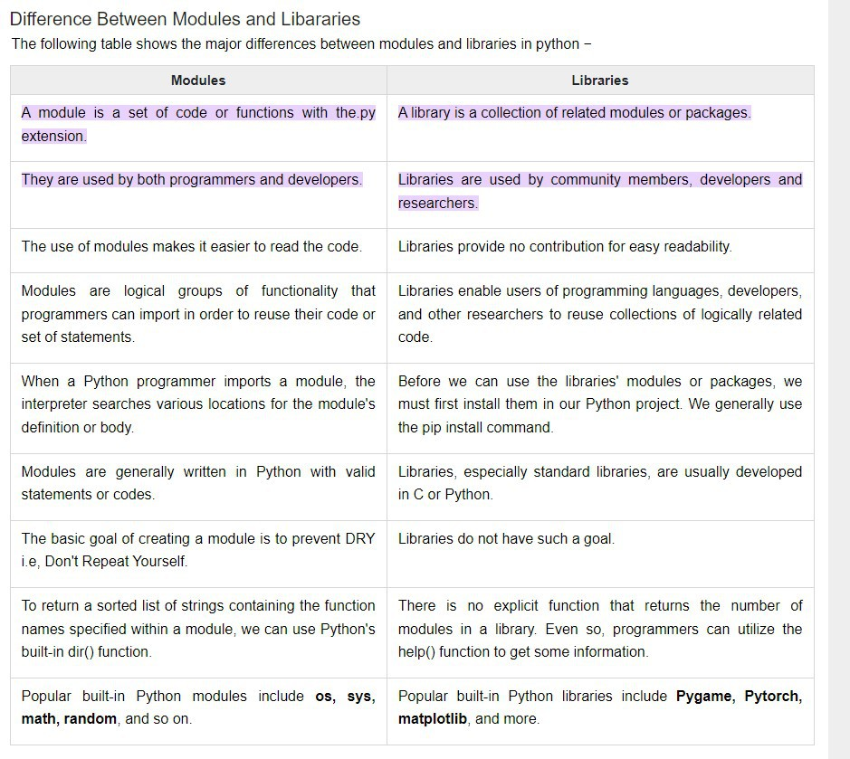

# Libraries and Modules

## What are libraries?

A collection of modules and packages that you can use to code more efficiently.

## What are modules?

Is a set of code/functions with the .py extension that you can call and use in a separate .py file.

